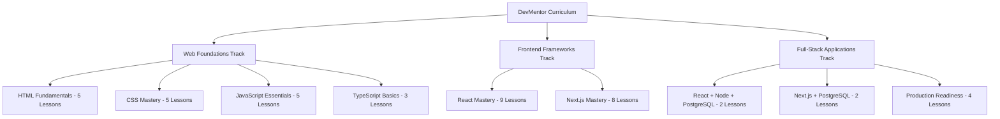
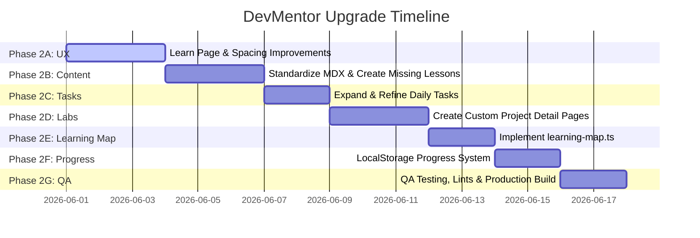

# Curriculum Audit: DevMentor Platform Upgrade

This document outlines the comprehensive audit of the current DevMentor learning platform's curriculum, roadmaps, daily developer tasks, project labs, and lesson structure. It identifies core gaps, analyzes structural consistency, and proposes a phase-wise roadmap to elevate DevMentor into an industry-grade, project-based self-guided learning platform.

---

## 1. Current Curriculum Summary

DevMentor's learning content is currently organized into **3 Tracks**, mapping to **43 MDX lessons** in the codebase. The role-based pathways are structured around **5 Roadmaps**, supported by **10 Daily Tasks** and **8 Project Labs**.

### Tracks & MDX Lessons



*   **Web Foundations Track** (`content/foundations` - 18 lessons):
    *   *HTML Fundamentals*: Intro to HTML, Semantic HTML, Form Validation & Accessibility, SEO & Performance, HTML Interview Guide.
    *   *CSS Mastery*: CSS Fundamentals, Flexbox Layout, CSS Grid Layout, CSS Variables & Nesting, CSS Interview Guide.
    *   *JavaScript Essentials*: JS Fundamentals, Async Programming, Event Loop & Delegation, Advanced JS & Memory Management, JS Interview Guide.
    *   *TypeScript Basics*: TS Fundamentals, Advanced Types & Generics, TS Interview Guide.
*   **Frontend Frameworks Track** (`content/frontend-frameworks` - 17 lessons):
    *   *React Mastery*: Intro to React, Building Components, React Hooks, Advanced State Management, Performance & Profiling, Fiber & Under the Hood, Server Components (RSC), Testing & Security, React Interview Guide.
    *   *Next.js Mastery*: Intro to Next.js, App Router Fundamentals, Building Full-Stack Apps, Next.js Caching & Revalidation, Advanced Server Actions, Parallel & Intercepting Routes, Performance Optimization & Scale, Next.js Interview Guide.
*   **Full-Stack Applications Track** (`content/fullstack` - 8 lessons):
    *   *React + Node + PostgreSQL*: Full-Stack Architecture, Express + PostgreSQL in Production.
    *   *Next.js + PostgreSQL*: Full-Stack with Next.js, Postgres ORMs & Query Performance.
    *   *Production Readiness*: Environment Variables, Docker Basics, Production Docker & Compose, Full-Stack Interview Guide.

### Roadmaps (`lib/roadmaps.ts`)
1.  **Intern Developer** (*Beginner* - 4 to 6 weeks): Focuses on semantic HTML, CSS layouts, JS fundamentals, Git, and static hosting.
2.  **Junior Frontend Developer** (*Intermediate* - 8 to 10 weeks): Focuses on React lifecycle, state management, TypeScript, API fetching, and TailwindCSS.
3.  **Mid-Level Full-Stack Developer** (*Advanced* - 12 to 16 weeks): Focuses on Next.js App Router, Express middlewares, PostgreSQL database schemas, and JWT authentication.
4.  **Senior UI Developer** (*Professional* - 16 to 20 weeks): Focuses on React Fiber internals, TS generics, Next.js caching, enterprise components, and Docker builds.
5.  **Technical Interview Preparation** (*Interview Prep* - 4 weeks): Focuses on system design, browser mechanics, mock code reviews, and structured explanation templates.

### Daily Developer Tasks (`lib/tasks.ts`)
1.  Reusable Button Component (*Beginner*)
2.  Reusable FormInput Component (*Beginner*)
3.  Responsive Navbar (*Beginner*)
4.  API Data Fetching with Loading/Error States (*Intermediate*)
5.  Search and Pagination Table (*Intermediate*)
6.  Protected Route Implementation (*Advanced*)
7.  Login Form with Token Storage (*Intermediate*)
8.  Role-Based Sidebar Menu (*Intermediate*)
9.  File Upload UI Component (*Advanced*)
10. Dashboard Stats Cards Grid (*Intermediate*)

### Project Labs (`lib/projects.ts`)
*   **Custom Pages** (3): Admin Dashboard Interface, E-commerce Product Listing, Resume Builder.
*   **Dynamic Fallback Pages** (5): Personal Portfolio Website, Blog CMS Web Application, Leave Management System, SaaS App with Authentication, AI-Powered Analysis Assistant.

---

## 2. Missing Topic Analysis

An audit of the existing MDX lessons against industry requirements for self-guided tech professionals reveals several gaps.

### A. Web Fundamentals
*   **How the web works**: 🔴 **Missing**. No dedicated lesson explaining DNS lookup, TCP/IP handshakes, DOM/CSSOM tree construction, or browser paint pipelines.
*   **Browser rendering basics**: 🟡 **Weak**. Briefly mentioned across CSS layout rendering but lacks a clear guide on the Critical Rendering Path (CRP), layout shifts, and compositing layers.
*   **DOM and BOM basics**: 🟡 **Weak**. DOM events are explained, but core Browser Object Model (BOM) APIs (e.g., `window.history`, `navigator`, `window.location`) are missing.
*   **HTTP, HTTPS, request/response lifecycle**: 🔴 **Missing**. No structured explanation of status codes (2xx, 3xx, 4xx, 5xx), request methods, headers, CORS, or SSL/TLS handshakes.
*   **REST API basics**: 🟡 **Weak**. Relies on task solutions; needs a structured theoretical explanation of endpoints, resources, HTTP verbs, and status returns.
*   **JSON basics**: 🟢 **Covered**. Sufficiently integrated within JavaScript and React fetching examples.
*   **Developer tools basics**: 🔴 **Missing**. No guide explaining elements panel inspection, network request auditing, console debugging, and performance profiling.
*   **Accessibility basics**: 🟢 **Covered**. Form and validation lesson outlines semantic requirements and ARIA attributes well.
*   **SEO basics**: 🟢 **Covered**. Dedicated HTML SEO & Performance lesson exists.
*   **Web performance basics**: 🟡 **Weak**. Touched upon in React/Next.js performance optimization, but general concepts (Core Web Vitals like LCP, FID, CLS, image optimization strategies, lazy loading) need unified coverage.

### B. HTML/CSS
*   **Semantic HTML**: 🟢 **Covered**. Excellent dedicated lesson.
*   **Forms and validation**: 🟢 **Covered**. Clear walkthrough on constraint validation APIs.
*   **Tables and accessibility**: 🔴 **Missing**. Missing guides on accessible semantic tables, `<caption>`, `<thead>`, `<tbody>`, and `scope` attributes for screen readers.
*   **CSS box model**: 🟡 **Weak**. Briefly mentioned in CSS intro but lacks a clear visual explanation of `content-box` vs `border-box` sizing differences.
*   **Flexbox & CSS Grid**: 🟢 **Covered**. Dedicated guides are structured well.
*   **Responsive design & Mobile-first layout**: 🟡 **Weak**. Mentioned in project pages but lacks a dedicated lesson teaching media queries, fluid units (`rem`, `em`, `vw`, `vh`), and mobile-first CSS architecture.
*   **CSS architecture**: 🔴 **Missing**. No guides covering CSS organization strategies (BEM, CSS Modules, Tailwind integration, CSS-in-JS).
*   **Design system basics**: 🔴 **Missing**. Missing definitions of design tokens (spacing scales, color maps, typography pairings, border-radius controls).

### C. JavaScript
*   **Variables, data types, operators**: 🟢 **Covered**. Basic variables and types are listed in JS intro.
*   **Functions, scope & closures**: 🟢 **Covered**. Scope and closures are covered in JS memory/advanced guides.
*   **Arrays and objects in real-time**: 🟢 **Covered**. Implemented across daily tasks.
*   **Array methods (map, filter, reduce, find, some, every)**: 🟢 **Covered**. Listed in ES6 guides and practiced in tasks.
*   **DOM events & Event delegation**: 🟢 **Covered**. Handled well in the event loop and delegation guide.
*   **Event loop, Promises, async/await, Fetch API**: 🟢 **Covered**. Comprehensive coverage in JS async and event loop lessons.
*   **Error handling**: 🟡 **Weak**. Try-catch blocks are used, but a dedicated lesson on writing clean custom `Error` classes, global error catchers, and promise rejection handling is missing.
*   **Debounce and throttle**: 🟡 **Weak**. Practiced inside the autocomplete tasks, but lacks a dedicated lesson text detailing logic implementations and rendering differences.
*   **Modules and imports**: 🔴 **Missing**. Missing explanations of ESM (ES Modules) vs CommonJS imports, exports, and path aliases.
*   **LocalStorage and SessionStorage**: 🟡 **Weak**. Used in cart and authentication tasks, but lacks a lesson outlining capacity limits, data serialization, and security pitfalls (XSS attacks).

### D. TypeScript
*   **TypeScript basics, Type aliases vs interfaces**: 🟢 **Covered**. Explained well in TS intro.
*   **Optional, readonly, Union, intersection, Generics, Utility types**: 🟢 **Covered**. Covered across the two core TS lessons.
*   **Type-safe API responses**: 🔴 **Missing**. No guides on typing REST payloads, dealing with `unknown` responses, or writing schema decoders (e.g., Zod schemas).
*   **Typing React props and events**: 🔴 **Missing**. Missing concrete examples of typing React props, component children, inline style props, and common DOM events (e.g., `React.ChangeEvent<HTMLInputElement>`).
*   **Common TS mistakes**: 🟡 **Weak**. Mentioned in interview guide but lacks visual examples showing type-assertion vs type-guarding, and when `any` can be safely avoided using `unknown`.

### E. React
*   **React mental model, JSX, Components, props, State, events, lists & keys**: 🟢 **Covered**. Thoroughly discussed in initial React guides.
*   **Forms in React**: 🟡 **Weak**. Forms are handled inside code solutions but lack a lesson explaining controlled vs uncontrolled inputs, custom validators, and state validation.
*   **useEffect correctly**: 🟢 **Covered**. Covered in React hooks lesson.
*   **Custom hooks**: 🟡 **Weak**. Needs a dedicated lesson teaching abstraction patterns with real-world examples (e.g., `useLocalStorage`, `useWindowSize`, `useFetch`).
*   **Context API & Component composition**: 🟢 **Covered**. Outlined in React state management.
*   **API integration patterns**: 🟡 **Weak**. Discussed briefly; needs structured patterns comparing `useEffect` fetching with fetch-on-render vs render-as-you-fetch, SWR, or TanStack Query.
*   **Loading, error, and empty states**: 🟡 **Weak**. Outlined in tasks but lacks a layout lesson.
*   **Error boundaries**: 🔴 **Missing**. No guides explaining React Error Boundary wrappers, recovery methods, and fallback component definitions.
*   **Performance optimization (memo, useMemo, useCallback)**: 🟢 **Covered**. Covered in profiling lesson.
*   **React testing basics**: 🟢 **Covered**. Covered in testing and security.
*   **Common React anti-patterns**: 🟡 **Weak**. Pitfalls exist in MDX, but need a structured catalog (e.g., state synchronization, mutating states in place).

### F. Next.js App Router
*   **App Router structure, Pages, layouts, Nested, Dynamic routes**: 🟢 **Covered**. Handled well in Next.js router guides.
*   **Server Components vs Client Components**: 🟢 **Covered**. Covered in React RSC and Next.js intro.
*   **Data fetching in Server Components**: 🟢 **Covered**. Outlined in Next.js fullstack.
*   **Client-side fetching**: 🟡 **Weak**. Needs clearer integration pathways alongside Server Components.
*   **Loading, error UI, Route handlers, Server Actions, Caching, revalidation**: 🟢 **Covered**. Comprehensive coverage.
*   **Metadata and SEO**: 🟡 **Weak**. Briefly mentioned; needs explanation of static/dynamic metadata configurations and OpenGraph settings.
*   **Middleware**: 🟢 **Covered**. Outlined in Routing & Middleware lesson.
*   **Authentication & Protected routes in Next.js**: 🟡 **Weak**. Mentioned but lacks configuration blueprints showing cookie security and session validation pipelines.
*   **Deployment on Vercel**: 🔴 **Missing**. Missing guide explaining environment variables setup, deployment hooks, build configurations, and Edge runtime parameters.

### G. Full-Stack / Backend Basics
*   **Node.js & Express API basics**: 🟢 **Covered**. Outlined in production Express guides.
*   **REST API design**: 🟡 **Weak**. Needs standards detailing pagination formats, filtering payloads, and unified JSON error structures.
*   **API validation**: 🟡 **Weak**. Lacks guides detailing data validations using schema engines like Zod or Joi on incoming Express requests.
*   **Authentication, JWT, Authorization, roles**: 🟢 **Covered**. Handled inside Express production guides.
*   **PostgreSQL basics, CRUD, ORMs (Prisma, Drizzle)**: 🟢 **Covered**. Comprehensive ORM database lesson exists.
*   **Database relationships**: 🟡 **Weak**. Relational schemas are coded in ORMs, but schema diagrams or SQL foreign key setups are weak.
*   **Pagination and filtering API**: 🟡 **Weak**. Coded in table tasks but lacks backend endpoint implementation details.
*   **File upload backend flow**: 🔴 **Missing**. Project descriptions mention media uploading but lack tutorials on S3/Supabase storage integrations and multipart parsing middlewares (e.g., Multer).
*   **Environment variables**: 🟢 **Covered**. Dedicated lesson.
*   **Error handling and logging**: 🟡 **Weak**. Outlined in production Express lessons but lacks guides explaining Winston/Morgan logging setups or Sentry configurations.
*   **Docker basics & Docker Compose**: 🟢 **Covered**. Detailed production containerization lessons exist.

### H. Production Readiness
*   **Git workflow & Branching strategy**: 🔴 **Missing**. Missing explanations of trunk-based development, git flow (feature/develop/main), rebase vs merge, and squash-commit practices.
*   **Pull request checklist**: 🔴 **Missing**. No guide explaining code reviews, writing pull requests, and standard self-review checklists.
*   **ESLint and Prettier**: 🔴 **Missing**. No lessons on configuring linters, formatter setups, and Git pre-commit hooks (e.g., Husky, lint-staged).
*   **Environment config**: 🟢 **Covered**. Handled in env variables.
*   **API error handling strategy**: 🟡 **Weak**. Needs a unified blueprint.
*   **Reusable component architecture**: 🟢 **Covered**. Outlined in React components.
*   **Accessibility checklist**: 🟢 **Covered**. Included in form validation.
*   **Performance checklist**: 🟡 **Weak**. Needs a unified checklist detailing bundle sizes, network calls, asset optimizations, and Core Web Vitals targets.
*   **Security basics**: 🟡 **Weak**. React/Next.js security guides exist, but full-stack security (CORS configurations, CSRF tokens, rate-limiting, Helmet.js headers) is weak.
*   **Testing strategy**: 🟡 **Weak**. Jest/React testing basics are covered, but a unified testing strategy (Unit vs Integration vs E2E with Playwright) is missing.
*   **Monitoring/logging basics**: 🔴 **Missing**. No explanation of error monitoring tools (Sentry), server log aggregates (Datadog/Loggly), or telemetry tools.
*   **Documentation and README**: 🔴 **Missing**. No guides on structuring project code documentation, writing professional READMEs, or maintaining API docs (Swagger/OpenAPI).

---

## 3. Lesson Quality Audit

Existing MDX lessons were analyzed to check for structural consistency. 

> [!IMPORTANT]
> A critical structural mismatch exists: **Only one lesson ([html-intro.mdx](file:///C:/DevMentor/content/foundations/html-intro.mdx)) implements the premium custom components** (`<TaskBox>`, `<AssignmentBox>`, `<InterviewExplanation>`, `<CommonMistake>`, `<InterviewTip>`, `<RealTimeExample>`).
> Almost all other 42 lessons rely on standard Markdown notes, using deprecated or un-registered components (e.g. `<Pitfall>`, `<ProTip>`, `<Checklist>`). They lack capstone assignments, tasks, and interview prep guides.

Below is the status of every lesson:

### Web Foundations (18 Lessons)
*   `html-intro.mdx`: 🟢 **Good**. Fully structured with premium components.
*   `html-semantic.mdx`: 🟡 **Needs improvement**. Uses deprecated `<Pitfall>`, `<ProTip>`, `<Checklist>`. Missing `TaskBox`, `AssignmentBox`, `InterviewExplanation`.
*   `html-forms-a11y.mdx`: 🟡 **Needs improvement**. Uses old `<Checklist>` and `<Pitfall>`. Missing `TaskBox`, `AssignmentBox`, `InterviewExplanation`.
*   `html-seo-performance.mdx`: 🟡 **Needs improvement**. Missing premium blocks, exercises, and tasks.
*   `html-interview-cracking.mdx`: 🟢 **Good**. Standard interview cracking guide.
*   `css-intro.mdx`: 🟡 **Needs improvement**. Uses deprecated structures. Missing tasks, custom assignment boxes.
*   `css-flexbox.mdx`: 🟡 **Needs improvement**. Lacks practical code tasks, capstones, and interview templates.
*   `css-grid.mdx`: 🟡 **Needs improvement**. Lacks standard structure.
*   `css-variables-nesting.mdx`: 🟡 **Needs improvement**. Lacks standard structure.
*   `css-interview-cracking.mdx`: 🟢 **Good**. Standard interview cracking guide.
*   `js-intro.mdx`: 🟡 **Needs improvement**. Very short code snippets. Uses old `<Pitfall>`. Missing task boxes and templates.
*   `js-async.mdx`: 🟡 **Needs improvement**. Lacks hands-on exercise templates and capstones.
*   `js-event-loop-dom.mdx`: 🟡 **Needs improvement**. Lacks premium blocks.
*   `js-advanced-es6-memory.mdx`: 🟡 **Needs improvement**. Lacks premium blocks.
*   `js-interview-cracking.mdx`: 🟢 **Good**. Standard interview cracking guide.
*   `ts-intro.mdx`: 🟡 **Needs improvement**. Short snippets, missing task/assignment/interview blocks.
*   `ts-advanced-generics.mdx`: 🟡 **Needs improvement**. Lacks premium components.
*   `ts-interview-cracking.mdx`: 🟢 **Good**. Standard interview cracking guide.

### Frontend Frameworks (17 Lessons)
*   `react-intro.mdx`: 🟡 **Needs improvement**. Short summary; uses old `<Pitfall>`, `<ProTip>`. Missing tasks and templates.
*   `react-components.mdx`: 🟡 **Needs improvement**. Missing hands-on task blocks.
*   `react-hooks.mdx`: 🟡 **Needs improvement**. Lacks standard structure.
*   `react-state-management.mdx`: 🟡 **Needs improvement**. Lacks standard structure.
*   `react-performance-profiling.mdx`: 🟡 **Needs improvement**. Lacks standard structure.
*   `react-fiber-architecture.mdx`: 🟡 **Needs improvement**. Lacks standard structure.
*   `react-server-components.mdx`: 🟡 **Needs improvement**. Lacks standard structure.
*   `react-security-testing.mdx`: 🟡 **Needs improvement**. Lacks standard structure.
*   `react-interview-cracking.mdx`: 🟢 **Good**. Standard interview cracking guide.
*   `nextjs-intro.mdx`: 🟡 **Needs improvement**. Lacks standard structure.
*   `nextjs-app-router.mdx`: 🟡 **Needs improvement**. Lacks standard structure.
*   `nextjs-fullstack.mdx`: 🟡 **Needs improvement**. Lacks standard structure.
*   `nextjs-caching-rendering.mdx`: 🟡 **Needs improvement**. Lacks standard structure.
*   `nextjs-advanced-actions.mdx`: 🟡 **Needs improvement**. Lacks standard structure.
*   `nextjs-routing-middleware.mdx`: 🟡 **Needs improvement**. Lacks standard structure.
*   `nextjs-optimization-monitoring.mdx`: 🟡 **Needs improvement**. Lacks standard structure.
*   `nextjs-interview-cracking.mdx`: 🟢 **Good**. Standard interview cracking guide.

### Full-Stack Applications (8 Lessons)
*   `rn-p-intro.mdx`: 🟡 **Needs improvement**. Lacks standard structure.
*   `express-postgres-production.mdx`: 🟡 **Needs improvement**. Lacks standard structure.
*   `nn-p-intro.mdx`: 🟡 **Needs improvement**. Lacks standard structure.
*   `prisma-drizzle-postgres.mdx`: 🟡 **Needs improvement**. Lacks standard structure.
*   `env-vars.mdx`: 🟡 **Needs improvement**. Lacks standard structure.
*   `docker-basics.mdx`: 🟡 **Needs improvement**. Lacks standard structure.
*   `docker-compose-production.mdx`: 🟡 **Needs improvement**. Lacks standard structure.
*   `fullstack-interview-cracking.mdx`: 🟢 **Good**. Standard interview cracking guide.

---

## 4. Learn Page Audit

An audit of `/learn` and `/learn/[track]` reveals structural and design discrepancies.

*   **Confusing Navigation Areas**: The track dashboard lists tracks by technical layer ("Web Foundations", "Frontend Frameworks", "Full-Stack Applications"). There is no visual entry point or suggestion telling users where to begin based on their profile. Beginners must guess which track fits them.
*   **Missing Role-Based Starting Points**: The `/learn` path does not directly link to the 5 role-based Roadmaps (`intern-developer`, `junior-frontend`, etc.). 
*   **Weak CTAs**: The track highlight headers display the CTA `"View Roadmap Path"`, but navigate to `/learn/[trackSlug]` instead of the actual role-based pathway (e.g. `/roadmaps/intern-developer`). This disconnects tracks from roadmaps.
*   **Missing Task/Project Connections**: In `/learn/[track]`, a vertical phase timeline lists lessons but hides associated daily tasks or projects. Learners cannot see the direct "Practice" or "Build" steps corresponding to the concepts they are studying.
*   **Grammar/Spacing Issues**: Text tags under timeline headers show layout shifts in narrow screen widths. List bullet points in MDX guides have inconsistent vertical line heights, causing overlapping text elements in some browser engines.
*   **Mobile Layout Risks**: The timeline connector line (`absolute left-[15px] top-2 bottom-6 w-[2px] bg-slate-200`) has fixed margins. On narrow screens (e.g., iPhone SE/5), the horizontal spacing wraps text headers and icon circles inappropriately.

---

## 5. Roadmap Audit

Reviewing the 5 roadmap configurations under `lib/roadmaps.ts` and the `/roadmaps/[slug]` page:

*   **Missing Code Review Checklists**: While the roadmap displays a checklist in the right sidebar (`roadmap.checklist`), it represents a general conceptual progress checklist. There is no specific **Code Review Checklist** instructing learners on code smells, performance criteria, or styling rules they must audit before completing task assignments.
*   **Vague Interview Outcomes**: The roadmaps lack concrete "Interview Outcomes". They list target skills (e.g., "React Component Life Cycle"), but do not clearly define *how* learners will describe these skills to hiring managers.
*   **Weak Next-Step CTAs**: When learners complete a roadmap, there are no dynamic CTAs guiding them to the next logical stage (e.g., moving from "Intern Developer" to "Junior Frontend Developer" or starting the "Technical Interview Prep" track).
*   **No Progress Tracking**: The roadmaps are completely static. Checking items off the sidebar checklist is volatile and resets upon page reload.

---

## 6. Daily Tasks Audit

Analyzing the 10 developer tasks inside `lib/tasks.ts`:

*   **Missing Beginner Tasks**: The current beginner tasks (`reusable-button`, `reusable-form-input`, `responsive-navbar`) jump straight to React components. There are no foundational JavaScript or CSS daily tasks (e.g., parsing raw query strings, styling accessible responsive tables, writing deep object comparisons).
*   **Missing React Tasks**: Core React challenges are missing. Gaps include implementing custom hooks (e.g., `useLocalStorage`), writing React Context state handlers, and testing React components using React Testing Library or Vitest.
*   **Missing Next.js Tasks**: There are no tasks covering modern Next.js patterns, such as creating Route Handlers (API endpoints), implementing Server Actions, configuring Next.js Middleware, or handling caching policies.
*   **Missing Backend/Database Tasks**: No tasks cover backend development. Gaps include setting up an Express router, validating request bodies using Zod, and querying relations in Prisma or SQL.
*   **Missing Testing/Quality Tasks**: No tasks require learners to write Vitest test suites, configure ESLint configurations, or establish pre-commit formatting hooks.
*   **Weak Task Requirements**: Some advanced tasks (e.g., `file-upload-ui`) have complex solutions but lack structured step-by-step requirements, senior verification checklists, or clear edge-case descriptions.

---

## 7. Project Labs Audit

Analyzing the 8 project blueprints in `lib/projects.ts`:

*   **Missing Project Types**: There is a gap in production-grade systems. The projects cover client-side apps, but lack a multi-tenant SaaS application or a deployment pipeline lab.
*   **Weak Dynamic Detail Pages**: 
    Only **3 out of 8 projects** have custom-designed detail pages (`admin-dashboard`, `ecommerce-listing`, `resume-builder`).
    The remaining **5 projects** (`personal-portfolio`, `blog-cms`, `leave-manager`, `saas-auth`, `ai-assistant`) render through the dynamic route `/projects/[slug]`. 
    
    This dynamic route is **weak** and lacks:
    *   Real-world business requirements
    *   Folder structure diagrams
    *   API contracts
    *   Database schemas
    *   Step-by-step implementation phases
    *   Testing & deployment checklists
    *   Senior developer notes

---

## 8. Recommended Final Curriculum Structure

To address these gaps, the curriculum should be restructured into **10 dedicated tracks**. This structure guarantees coverage of all requested topics and maps them to practical assignments.

```
                  ┌──────────────────────────────────────────────┐
                  │            01. Web Fundamentals              │
                  └──────────────────────┬───────────────────────┘
                                         ▼
                  ┌──────────────────────────────────────────────┐
                  │              02. HTML & CSS                  │
                  └──────────────────────┬───────────────────────┘
                                         ▼
                  ┌──────────────────────────────────────────────┐
                  │           03. JavaScript Mastery             │
                  └──────────────────────┬───────────────────────┘
                                         ▼
                  ┌──────────────────────────────────────────────┐
                  │        04. TS for Real Projects              │
                  └──────────────────────┬───────────────────────┘
                                         ▼
                  ┌──────────────────────────────────────────────┐
                  │            05. React Development             │
                  └──────────────────────┬───────────────────────┘
                                         ▼
                  ┌──────────────────────────────────────────────┐
                  │           06. Next.js App Router             │
                  └──────────────────────┬───────────────────────┘
                                         ▼
                  ┌──────────────────────────────────────────────┐
                  │          07. Full-Stack Dev (Express)        │
                  └──────────────────────┬───────────────────────┘
                                         ▼
                  ┌──────────────────────────────────────────────┐
                  │            08. Testing & Quality             │
                  └──────────────────────┬───────────────────────┘
                                         ▼
                  ┌──────────────────────────────────────────────┐
                  │          09. Production Readiness            │
                  └──────────────────────┬───────────────────────┘
                                         ▼
                  ┌──────────────────────────────────────────────┐
                  │           10. Interview Preparation          │
                  └──────────────────────────────────────────────┘
```

### Track 1: Web Fundamentals
*   **Proposed Lessons**:
    *   `web-works`: How the Web Works (DNS, HTTP/S, TCP/IP, request-response cycle).
    *   `browser-rendering`: The Browser Rendering Pipeline (CRP, layout, paint, composite).
    *   `network-basics`: REST APIs & JSON Fundamentals.
    *   `devtools-guide`: Chrome Developer Tools Basics.
*   **Daily Tasks**: Request validation query parsing; Network status code decoder.
*   **Project Lab**: Personal portfolio hosting architecture design.
*   **Interview Outcomes**: Explain the network and browser steps that occur when you type a URL into a browser address bar.

### Track 2: HTML & CSS
*   **Proposed Lessons**:
    *   `html-semantic`: Semantic HTML and Landmark layouts.
    *   `html-forms-a11y`: Accessible form designs & WCAG constraint validations.
    *   `css-box-model`: The Box Model, custom CSS properties, and layout resets.
    *   `css-layouts`: Modern Grid & Flexbox layouts.
    *   `css-responsive`: Responsive mobile-first designs & CSS architecture.
*   **Daily Tasks**: Accessible multi-column form; CSS Grid responsive card gallery.
*   **Project Lab**: Personal Portfolio Website (`personal-portfolio`).
*   **Interview Outcomes**: Explain the layout differences between Grid and Flexbox, and how to visually hide labels for screen readers.

### Track 3: JavaScript Mastery
*   **Proposed Lessons**:
    *   `js-scopes`: Variable bindings, lexical scope, and closures.
    *   `js-async`: Async flow controls (Promises, async/await, error bounds).
    *   `js-event-loop`: The Event Loop, execution stacks, and event delegation.
    *   `js-apis`: LocalStorage, SessionStorage, and client-side cache limitations.
*   **Daily Tasks**: Custom debounce function; Array transformer (`map`/`filter`/`reduce` implementations).
*   **Project Lab**: Interactive Client-Side Quiz Board.
*   **Interview Outcomes**: Describe how closures lead to memory leaks, and walk through event loop queue priorities.

### Track 4: TypeScript for Real Projects
*   **Proposed Lessons**:
    *   `ts-fundamentals`: Core types, interfaces, optional parameters, and union structures.
    *   `ts-generics`: Advanced types, generics, and built-in utilities.
    *   `ts-react`: Typing React component props, children, and DOM events.
    *   `ts-api-validation`: Handling type-safe API payloads with schema validators.
*   **Daily Tasks**: Type-safe fetch wrapper; Typed form handler.
*   **Project Lab**: Type-Safe API Client interface.
*   **Interview Outcomes**: Contrast interface extensions with type intersections, and show how to narrow `unknown` types safely.

### Track 5: React Development
*   **Proposed Lessons**:
    *   `react-fundamentals`: JSX elements, list keys, and conditional rendering.
    *   `react-hooks-core`: State handlers (`useState`, `useReducer`) and synchronization (`useEffect`).
    *   `react-hooks-custom`: Creating custom hooks for reusability.
    *   `react-state-context`: Global states, Context API, and component composition.
    *   `react-perf`: React Fiber, reconciler, and render optimization hooks (`memo`, `useMemo`, `useCallback`).
*   **Daily Tasks**: Infinite scrolling loader; Global Toast notifier hook.
*   **Project Lab**: E-commerce Product Listing App (`ecommerce-listing`).
*   **Interview Outcomes**: Explain how the React Fiber reconciler reconciles DOM elements, and outline steps to prevent rendering loops in `useEffect`.

### Track 6: Next.js App Router
*   **Proposed Lessons**:
    *   `nextjs-routing`: Pages, layouts, nested routes, and dynamic route parameters.
    *   `nextjs-rsc`: Server Components vs Client Components.
    *   `nextjs-data`: Data fetching, Route Handlers, and cache revalidation pipelines.
    *   `nextjs-actions`: Server Actions, form states (`useActionState`), and optimistic updates.
    *   `nextjs-middleware`: Middleware structures, cookie handling, and route protection.
*   **Daily Tasks**: Authentication middleware checker; Form validation with Server Actions.
*   **Project Lab**: Resume Builder App (`resume-builder`).
*   **Interview Outcomes**: Compare the rendering differences of Server Components vs Client Components, and outline the caching lifecycle of the App Router.

### Track 7: Full-Stack Development
*   **Proposed Lessons**:
    *   `express-api`: Node.js, Express structures, routing, and error handlers.
    *   `express-validation`: Middleware validations using Zod models.
    *   `postgres-basics`: PostgreSQL relations, indexes, and migrations.
    *   `express-security`: JWT authentication, HTTP-only cookies, and role-based routes.
    *   `file-uploads`: Managing file uploads via Multer and cloud storage integrations.
*   **Daily Tasks**: JWT login middleware; Zod validation schema handler.
*   **Project Lab**: Blog CMS Web Application (`blog-cms`).
*   **Interview Outcomes**: Design a secure authentication pipeline using JWT and HttpOnly cookies, detailing the mitigation of XSS and CSRF risks.

### Track 8: Testing & Quality
*   **Proposed Lessons**:
    *   `testing-basics`: Unit testing utility functions with Vitest.
    *   `testing-components`: Component and hook testing using React Testing Library.
    *   `testing-e2e`: End-to-End testing dashboards using Playwright.
*   **Daily Tasks**: Unit test suite for custom hooks; E2E login validation script.
*   **Project Lab**: Leave Management System with 90% Test Coverage (`leave-manager`).
*   **Interview Outcomes**: Describe your testing hierarchy and explain how you stub/mock API dependencies during integration tests.

### Track 9: Production Readiness
*   **Proposed Lessons**:
    *   `production-git`: trunk-based branching models, squash commits, and PR reviews.
    *   `production-linting`: Custom ESLint parser rules and Husky pre-commit hooks.
    *   `production-docker`: Multi-stage Docker packaging pipelines.
    *   `production-monitoring`: Integration audits, Sentry logging, and metadata headers.
*   **Daily Tasks**: Multi-stage Dockerfile setup; Custom ESLint lint configuration script.
*   **Project Lab**: SaaS App with Authentication (`saas-auth`).
*   **Interview Outcomes**: Describe a multi-stage Docker build pipeline and explain how you structure an environment config across staging and production.

### Track 10: Interview Preparation
*   **Proposed Lessons**:
    *   `interview-templates`: The 7 architectural pillars template for presenting projects.
    *   `interview-profiling`: Chrome DevTools debugging and performance audit guides.
    *   `interview-system-design`: Front-end system design (caching, CDNs, assets).
*   **Daily Tasks**: Telemetry performance audit sheet; Code review response draft.
*   **Project Lab**: AI-Powered Analysis Assistant (`ai-assistant`).
*   **Interview Outcomes**: Pitch the AI Assistant project, highlighting scaling challenges, performance budgets, and error recoveries.

---

## 9. Implementation Plan

The platform upgrade will follow a structured, phase-wise implementation plan.



### Phase 2A: Improve Learn Page and Track Pages
*   **Goal**: Refine navigational pathways, add role-based entries, and resolve mobile responsiveness risks.
*   **Deliverables**:
    *   Update `/learn/page.tsx` to add visual onboarding banners linking to the 5 role-based Roadmaps.
    *   Correct track headers to link to `/roadmaps/[slug]` instead of track modules.
    *   Update `/learn/[track]/page.tsx` to display related Daily Tasks and Project blue prints in the timeline.
    *   Fix responsive padding classes for timelines, preventing horizontal clippings.

### Phase 2B: Create or Update MDX Lessons
*   **Goal**: Standardize the 43 existing lessons under a single structural design, and write lessons for missing Web/Git fundamentals.
*   **Deliverables**:
    *   Update the 42 lessons to replace deprecated components (`<Pitfall>`, `<ProTip>`, `<Checklist>`) with the standard ones (`<CommonMistake>`, `<SeniorNote>`, `<ProjectChecklist>`, `<AssignmentBox>`, `<InterviewExplanation>`, `<InterviewTip>`).
    *   Ensure each lesson contains a clear Capstone assignment and a technical interview template.
    *   Create 5 new lessons: `web-works`, `devtools-guide`, `ts-react`, `express-validation`, and `production-git`.

### Phase 2C: Update Daily Tasks
*   **Goal**: Refine `lib/tasks.ts` to add missing tasks for React hooks, Express routers, Zod validation schemas, and Vitest test suites.
*   **Deliverables**:
    *   Implement 5 new daily tasks to bring the total count to 15.
    *   Standardize requirements, expected outputs, hints, common mistakes, and solutions across all tasks.

### Phase 2D: Update Project Labs
*   **Goal**: Replace the dynamic fallback page `/projects/[slug]` with custom-designed detail pages for the remaining 5 projects.
*   **Deliverables**:
    *   Create customized detail page files for: Personal Portfolio, Blog CMS, Leave Management System, SaaS App with Authentication, and AI-Powered Assistant.
    *   Include real-world business requirements, API contracts, folder trees, PostgreSQL schemas, and step-by-step implementation phases.

### Phase 2E: Add Learning Map
*   **Goal**: Create a dependency map linking lessons, tasks, and projects to automate progress pathways.
*   **Deliverables**:
    *   Create `lib/learning-map.ts` outlining the prerequisites and next steps for every lesson.
    *   Expose helper functions to calculate completion statuses across tracks.

### Phase 2F: Add localStorage Progress Tracking
*   **Goal**: Add client-side progress tracking so users can check off lessons and save completed tasks.
*   **Deliverables**:
    *   Create a clean, lightweight React context (`ProgressContext`) storing state in `localStorage`.
    *   Sync checklist completions and task outcomes with this progress state.

### Phase 2G: Run QA, Lint, and Build
*   **Goal**: Audit the entire updated workspace to verify clean build completions.
*   **Deliverables**:
    *   Verify all Next.js routes run without runtime warnings.
    *   Execute lint checks and run a production build (`npm run build`) to ensure the application compiles cleanly.

---

## 10. Risk Notes

*   **Content Overload**: Adding new lessons might overwhelm beginners. Keep lessons bite-sized, practical, and highly focused on code.
*   **Duplicate Content**: React and Next.js guides risk repeating hooks or styling concepts. Ensure React lessons focus on core hooks and the Next.js track focuses on rendering pipelines and folder structures.
*   **Volatile Progress Tracking**: LocalStorage works for a simple MVP, but is client-only. Keep the API simple so it can easily migrate to a database backend (e.g., PostgreSQL/Supabase) in the future.
*   **Simplifying Web Fundamentals**: Web networking (DNS, SSL, TCP) is complex. Avoid deep networking jargon; focus on how these topics directly impact front-end performance, headers, and security context.
*   **Premature Auth & DB Code**: Avoid implementing custom authentication backends or live database handlers. Stick to mock JSON API endpoints and client-side local storage states for daily tasks, leaving database configurations to the advanced project blue prints.
